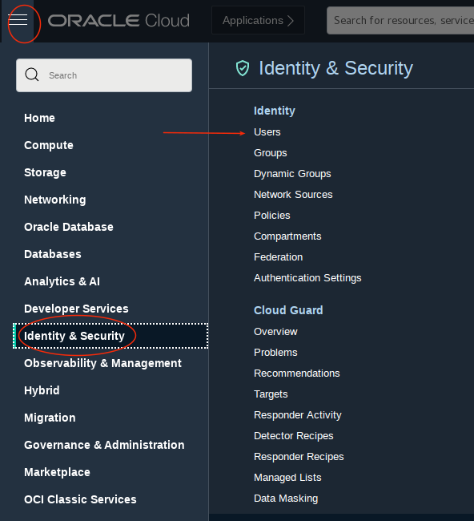
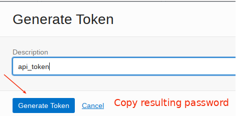
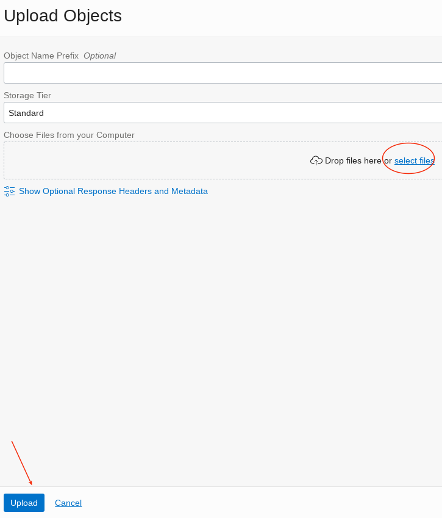
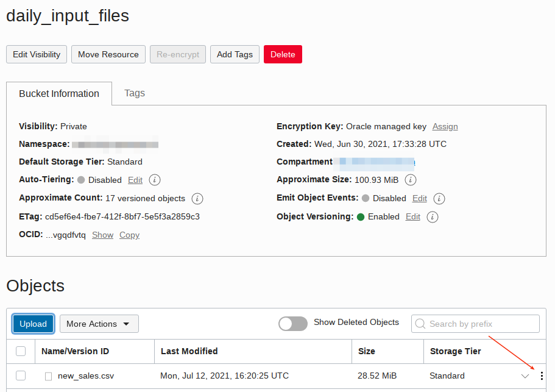
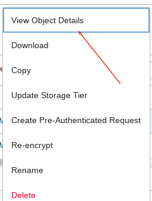
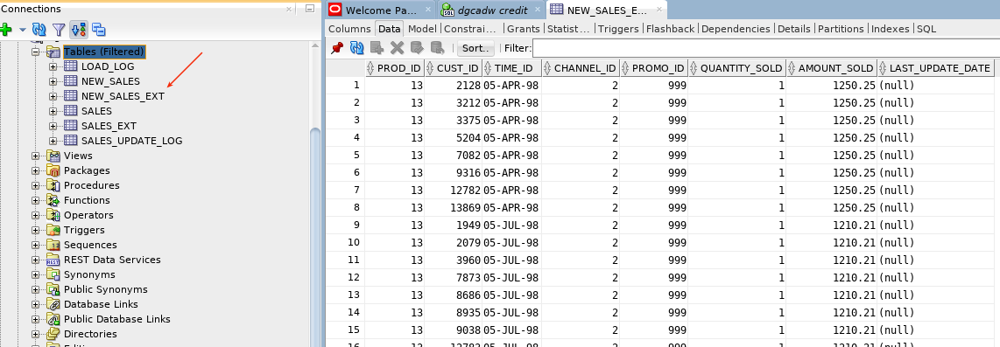

# Case Study in the Use of DBMS_CLOUD (and Other Core Database Features) to Automate Loading Data into Autonomous Database (ADB)

Derrick Cameron
July, 2021

This documents a case study on work with a customer who had the following requirements (not strictly limited to dbms_cloud features):
- Automated load that processes data from daily and weekl csv files in Object Storage.
- Deletes the files once they are loaded.
- Log load processes.
- Audit updates to data with information about what was changed and when.
- Provide a dashboard that shows various daily, weekly and quarterly metrics current and prior measures, with logic that handles missing data points.

There are various ways to do this, and the availability of cloud services such as events (detection of file uploads to object storage) and functions (process to load the data), use of these services is often the preferred approach (see an example of this [here](https://github.com/oracle/oracle-functions-samples/tree/master/samples/oci-load-file-into-adw-python)).  This is certainly the case where processes are orchestrated and may involve other cloud services, however it does add some complexity, other dependent platforms and services, and the need to master python or java.

This documents an alternative approach that only requires the use of SQL (which is needed in any case) and no other platform.  It is scalable and can process millions of records in seconds even using a minimal 1-ocpu ADB shape, and also offers the full power of the SQL language to handle the processing of object storage files as though they were native database files.  To illustrate we'll use data from the sh schema that is available in every Oracle Database so others can replicate these steps in their own environment.  We'll copy the *sales* table from the *sh* schema to a new *demo* schema so we can update it, but will leave the other sh tables as is and will be querying them.

## **STEP 1:** Create an Auth Token so ADB Can read files in Object Storage:

- Navigate to your users

  

- Select the your cloud user and then select *Auth Tokens* on the left and then *Generate Token*.  I called my api key *api_token*.  Be sure to copy the generated key.

  

  

## **STEP 2:** Log into the *Admin* database user and create a database user demo with the required permissions, create a credential, and copy the sales table from sh.  You can use either SQL Developer off the cloud console or sql developer client:

- Create a new schema that will own objects (userid demo in this case) and grant the necessary privileges:
```
<copy>
create user demo identfied by <password>;
grant dwrole, oml_developer, create table, create view to demo;
grant read, write on directory data_pump_dir to demo;
grant execute on dbms_cloud to demo;
alter user demo quota unlimited on data;
</copy>
```

- Log into the demo user and create a new credential.  Note if you are using a federated user you will need the federated identity in addition to the userid itself (eg: oracleidentitycloudservice/dgcameron).  If you called your api key something else the modify accordingly.
```
<copy>
BEGIN
  DBMS_CLOUD.CREATE_CREDENTIAL(
    credential_name => 'api_token',
    username => '<cloud userid>', 
    password => '<generated auth token password>'
  );
END;
/
</copy>
```

- Copy the sales table from sh to userid demo.
```
<copy>
create table sales as select * from sh.sales;
</copy>
```

## **STEP 3:** Create a new object storage bucket, upload new_sales.csv to object storage, and create an external table on that file.

- Create a new bucket called *daily_input_files*.

  

- Upload file *new_sales.csv* to this new bucket.  The file is in the *data* directory of this git repository.

  

  

- Copy the file URL from the uploaded file.

  

  

  

- Create a new external table that reads data from this file.
```
<copy>
BEGIN
 DBMS_CLOUD.CREATE_EXTERNAL_TABLE(
 table_name =>'new_sales_ext',
 credential_name =>'api_token',
 file_uri_list =>'<file URI>',
 format => json_object('delimiter' value ',', 'removequotes' value 'true','ignoremissingcolumns' value 'true','blankasnull' value 'true','skipheaders' value '1'),
 column_list => 'prod_id number, cust_id number, time_id date, channel_id number, promo_id number, quantity_sold number, amount_sold number, last_update_date date');
END;
</copy>
```

- Click on the new_sales_ext table and view data to confirm the table was created properly.  *Note: the file in object storage does NOT need to exist to create the external table.  It just needs to exist when you query the table.*

  

## **STEP 4:** Create other objected used in this case study.  Run the following in the demo schema:
```
<copy>
create table sales_update_log (
prod_id number
, cust_id number
, time_id date
, channel_id number
, promo_id number
, old_quantity_sold number
, new_quantity_sold number
, old_amount_sold number
, new_amount_sold number
, update_date date);

create table load_log (
load_type varchar2(100),
file_processed varchar2(1000),
rows_processed number,
load_date date);
</copy>
```

## **STEP 5:** Create database triggers to log changes to the sales table.
```
<copy>
CREATE OR REPLACE TRIGGER sales_trg
AFTER UPDATE OF quantity_sold, amount_sold ON sales
FOR EACH ROW

BEGIN

INSERT INTO sales_update_log
   ( prod_id,
     cust_id,
     time_id,
     channel_id,
     promo_id,
     old_quantity_sold,
     new_quantity_sold,
     old_amount_sold,
     new_amount_sold,
     update_date)
   VALUES
   ( :new.prod_id,
     :new.cust_id,
     :new.time_id,
     :new.channel_id,
     :new.promo_id,
     :old.quantity_sold,
     :new.quantity_sold,
     :old.amount_sold,
     :new.amount_sold,
     sysdate );

END;
/

CREATE OR REPLACE TRIGGER sales_trg2
BEFORE UPDATE ON sales
FOR EACH ROW

BEGIN

:new.last_update_date := sysdate;

END;
/
</copy>
```


